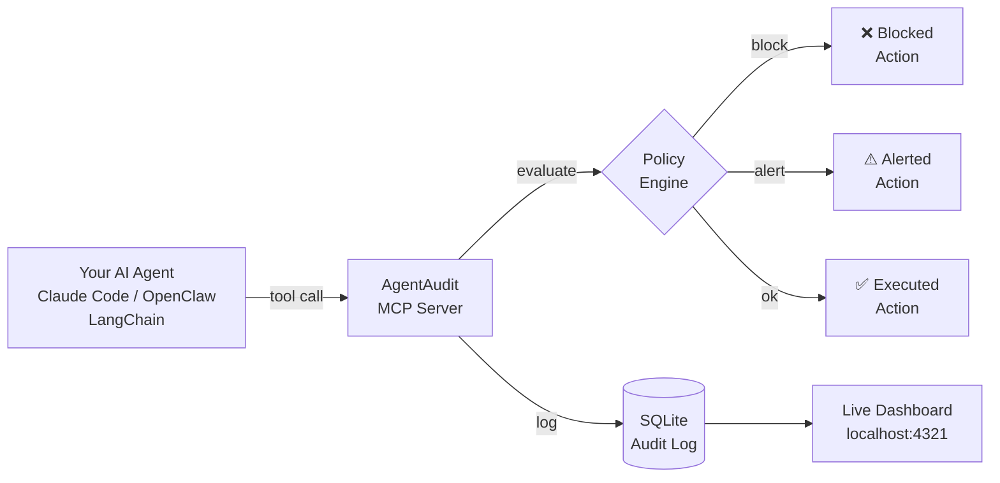

# AgentAudit

**The open source firewall for AI agents.**

AgentAudit sits between your AI agents and your system —
intercepting every tool call, enforcing plain-English policies,
and blocking dangerous actions before they happen.

Works with any MCP-compatible agent runtime including Claude Code,
OpenClaw, LangChain, and more.

Think of it as a flight recorder + firewall for the agentic era.


---

## How It Works


---

## Quickstart

**Install in 60 seconds:**

```bash
# Step 1 — Clone and install
git clone https://github.com/dipampatel1/agentaudit.git
cd agentaudit
npm install

# Step 2 — Register with your agent runtime
claude mcp add agentaudit -s user -- node --experimental-sqlite PATH/agentaudit/src/index.js start

# Step 3 — Start AgentAudit
node --experimental-sqlite src/index.js start

# Step 4 — Open dashboard
node --experimental-sqlite src/index.js dashboard
```

Visit http://localhost:4321 — you're live.

---

## Define Your Policies

Edit `.agentaudit.yml` in plain English:

```yaml
version: 1
policies:
  - name: "No deletions"
    rule: "never run any bash command containing rm"
    action: block

  - name: "Alert on outbound HTTP"
    rule: "alert when tool is web_fetch or http_request"
    action: alert

  - name: "Protect production"
    rule: "block any file write outside the /tmp directory"
    action: block
```

---

## Features

- **Action Interceptor** — captures every MCP tool call your agent makes
- **Audit Log** — writes every action to a local SQLite database
- **Policy Engine** — define rules in plain English, block or alert on violations
- **Live Dashboard** — real-time view of actions, violations, and sessions
- **Runtime Agnostic** — works with Claude Code, OpenClaw, LangChain, any MCP runtime

---

## Why AgentAudit?

AI agents can read files, run commands, fetch URLs, and write to
your system autonomously. That's powerful. It's also dangerous
without visibility.

AgentAudit answers the question every developer and CTO asks:

> "What exactly did the agent do, and can we stop it from doing
> something catastrophic?"

---

## Roadmap

- [x] MCP tool call interceptor
- [x] SQLite audit log
- [x] Plain-English policy engine
- [x] Live local dashboard
- [ ] Cloud sync + hosted dashboard
- [ ] Multi-agent chain monitoring
- [ ] Plugin/skill marketplace scanner
- [ ] Team seats + compliance exports

---

## Contributing

AgentAudit is MIT licensed and open to contributions.
Open an issue or submit a PR.

---

## License

MIT
