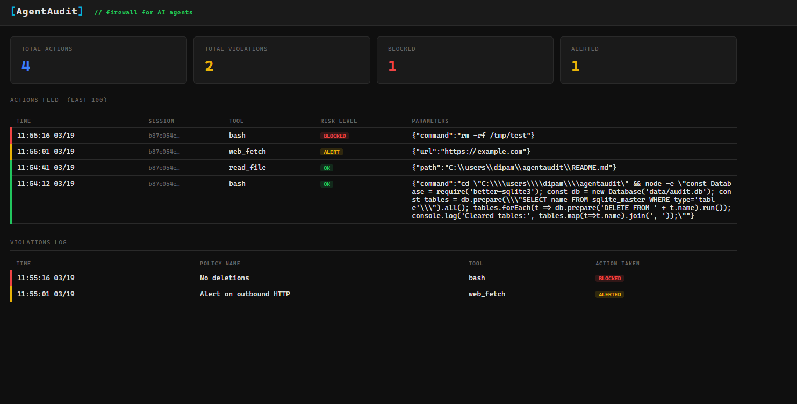

# AgentAudit

**The open source firewall for AI agents.**

AgentAudit sits between Claude Code and your system, intercepting every
tool call your agent makes — logging it, evaluating it against your
policies, and blocking anything dangerous before it happens.

Think of it as a flight recorder + firewall for the agentic era.



---

## Why AgentAudit?

AI agents are powerful. They can read files, run commands, fetch URLs,
and write to your system — autonomously. That's incredible. It's also
terrifying without visibility.

AgentAudit answers the question every developer and CTO asks:

> "What exactly did the agent do, and can we stop it from doing
> something catastrophic?"

---

## Features

- **Action Interceptor** — captures every MCP tool call Claude Code makes
- **Audit Log** — writes every action to a local SQLite database
- **Policy Engine** — define rules in plain English, block or alert on violations
- **Live Dashboard** — real-time view of actions, violations, and sessions

---

## Quick Start

### 1. Install
```bash
git clone https://github.com/YOUR_USERNAME/agentaudit.git
cd agentaudit
npm install
```

### 2. Register with Claude Code
```bash
claude mcp add agentaudit -s user -- node --experimental-sqlite PATH_TO/agentaudit/src/index.js start
```

### 3. Start AgentAudit
```bash
node --experimental-sqlite src/index.js start
```

### 4. Open the dashboard
```bash
node --experimental-sqlite src/index.js dashboard
```

Visit http://localhost:4321

---

## Define Your Policies

Edit `.agentaudit.yml` in plain English:
```yaml
version: 1
policies:
  - name: "No deletions"
    rule: "never run any bash command containing rm"
    action: block

  - name: "Alert on outbound HTTP"
    rule: "alert when tool is web_fetch or http_request"
    action: alert

  - name: "Protect production"
    rule: "block any file write outside the /tmp directory"
    action: block
```

---

## How It Works
```
Claude Code Session
       ↓
AgentAudit MCP Server (intercepts every tool call)
       ↓
Policy Engine (evaluates against .agentaudit.yml)
       ↓
Action Executed or Blocked
       ↓
SQLite Audit Log + Live Dashboard
```

---

## Roadmap

- [x] MCP tool call interceptor
- [x] SQLite audit log
- [x] Plain-English policy engine
- [x] Local dashboard
- [ ] Cloud sync + hosted dashboard
- [ ] Multi-agent chain monitoring
- [ ] Plugin/skill marketplace scanner
- [ ] Team seats + compliance exports

---

## Contributing

AgentAudit is MIT licensed and open to contributions.
Open an issue or submit a PR.

---

## License

MIT
